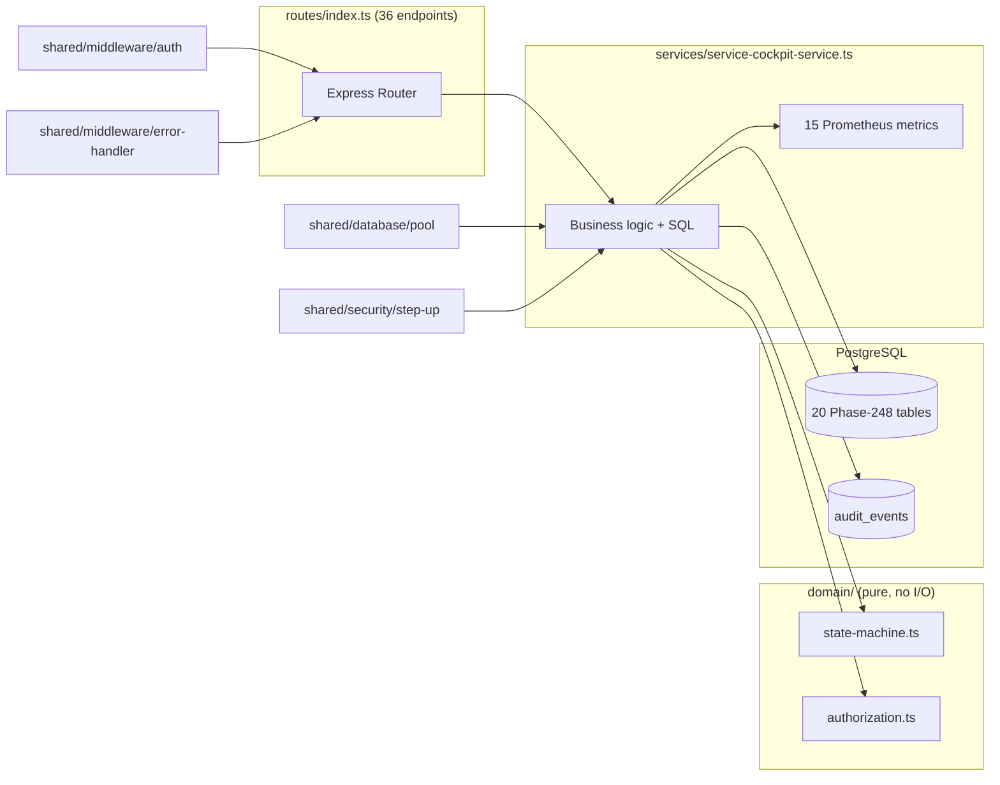
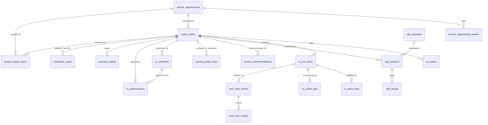
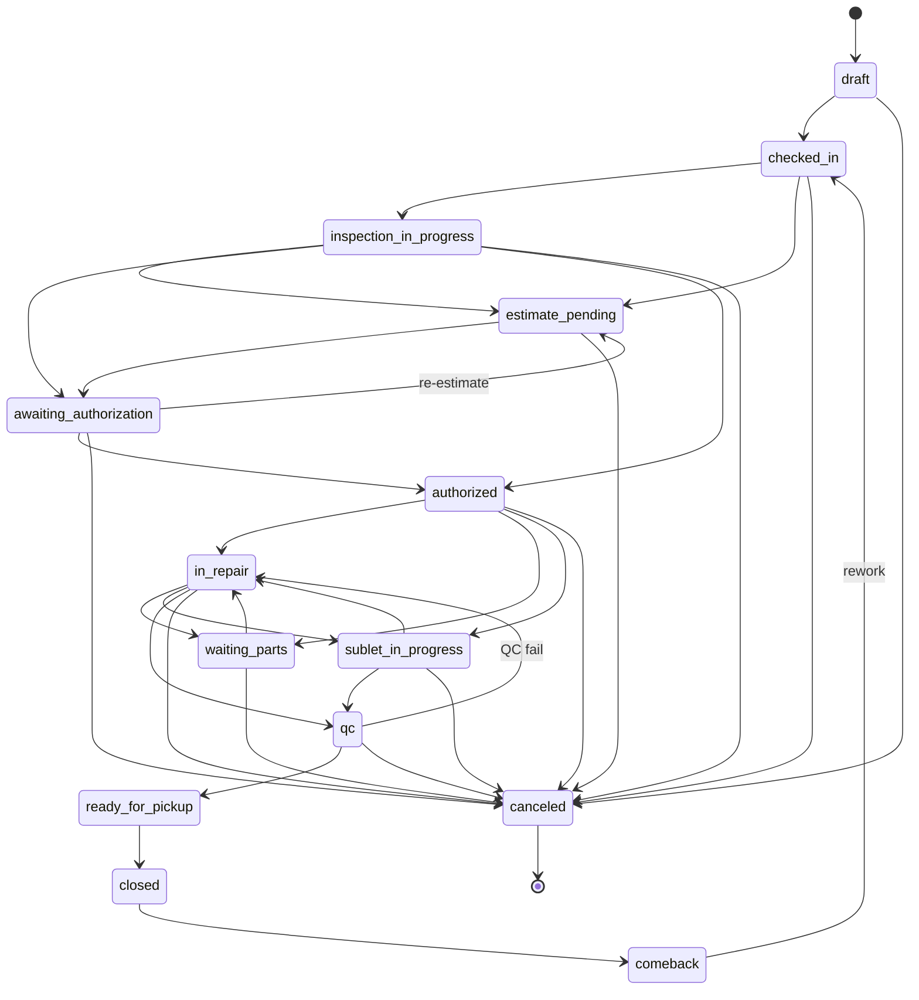

# Phase 248 — Service Cockpit v2 & Fixed Ops Operations Platform

**Architecture & API Reference**

| | |
|---|---|
| **Origin** | `phase-248-service-cockpit-v2` bundle (3 files, 1,523 lines) |
| **Status** | Hardened and expanded into a runnable service — see [REMEDIATION.md](REMEDIATION.md) |
| **Stack** | Node.js / TypeScript · Express · PostgreSQL · prom-client (Prometheus) |
| **Surface** | 20 tables · 36 endpoints · 13 subdomains · 15 metrics |

---

## Table of Contents

1. [Executive Summary](#1-executive-summary)
2. [Repository Layout](#2-repository-layout)
3. [System Context & External Identifiers](#3-system-context--external-identifiers)
4. [Domain Architecture — 13 Subdomain Cluster Map](#4-domain-architecture--13-subdomain-cluster-map)
5. [Data Model — 20 Tables](#5-data-model--20-tables)
6. [Repair Order State Machine](#6-repair-order-state-machine)
7. [API Surface — 36 Endpoints](#7-api-surface--36-endpoints)
8. [Service Layer Reference](#8-service-layer-reference)
9. [Observability — 15 Prometheus Metrics](#9-observability--15-prometheus-metrics)
10. [Cross-Cutting Concerns](#10-cross-cutting-concerns)
11. [End-to-End Flows](#11-end-to-end-flows)
12. [Known Gaps](#12-known-gaps)
13. [Operating the Service](#13-operating-the-service)
14. [Appendix — Quick Reference](#14-appendix--quick-reference)

---

## 1. Executive Summary

This service implements **"Fixed Ops"** — the service-department side of an automotive dealership platform (appointments, repair orders, digital vehicle inspections, estimates, customer authorizations, parts, sublets, technician dispatch and time tracking, warranty claims, comeback/quality cases, work queues with SLAs, and a post-sale first-service retention bridge). It is organized as **13 named subdomains** (SCM2, SSIS2, ROLS2, DMRS2, EAS2, POS2, SOS2, TDTS2, WPCS2, QCS2, SSR2, CSPP2, PSFSRB2).

The core aggregate is the **repair order (RO)**, driven by an explicit 14-state machine whose `authorized` transition is gated on genuine customer-authorization evidence for the *current* estimate version, plus step-up re-authentication. Everything else — line items, inspections, estimates, parts, sublets, work tickets, warranty claims, comebacks, queue items, portal tasks — hangs off the RO. The system is bilingual (English/Spanish `*_i18n` JSONB payloads), multi-tenant (`tenant_id` on every table and in every query predicate), event-logged (append-only `ro_events` / `service_appointment_events`), and instrumented with 15 Prometheus metrics.

**Design posture.** All SQL is parameterized and dynamic `UPDATE` builders whitelist column names. Status enums are enforced by `CHECK` constraints in the database and validated again at the service boundary. Every multi-write operation is transactional, with domain events committing alongside the change they describe and best-effort audit rows emitted after the commit. Tenant identity comes from the verified bearer token and is never read from a request body. Every route is role-gated.

The original bundle's six High-severity defects — missing tenant scoping, absent RBAC, an unvalidated step-up token, no transactions, a non-idempotent check-in, and forgeable customer authorizations — are documented with their fixes in [REMEDIATION.md](REMEDIATION.md). Remaining lower-severity gaps are in [§12](#12-known-gaps).

---

## 2. Repository Layout

```text
migrations/
  000_platform_core.sql              audit_events, pgcrypto guard
  049_phase248_service_cockpit.sql   20 tables, 45 index statements
src/
  app.ts                             express wiring, /healthz, /metrics
  server.ts                          startup, env validation, graceful shutdown
  types/express.d.ts                 Request.tenantContext augmentation
  shared/
    database/pool.ts                 query(), withTransaction(), Executor
    middleware/auth.ts               authenticate, authorize, roles, tenant guards
    middleware/error-handler.ts      typed errors, JSON error envelope
    security/step-up.ts              bound short-lived re-auth tokens
    utils/logger.ts                  structured logging with key redaction
    utils/helpers.ts                 generateId (UUID), isUuid, distinct
  modules/service-cockpit/
    domain/state-machine.ts          RO statuses, transitions, gate flags
    domain/authorization.ts          authorization/estimate status derivation
    routes/index.ts                  36 endpoints, role-gated
    services/service-cockpit-service.ts   business logic, SQL, metrics
scripts/migrate.ts                   ordered transactional migration runner
tests/                               39 unit tests (no database required)
```

Layering is strict: **routes → service → database**. Routes contain no SQL; the service contains no
HTTP concerns; `domain/` holds pure rules with no I/O, which is what makes them unit-testable.

---

## 3. System Context & External Identifiers

Identifiers owned by other domains are stored as plain UUIDs with **no foreign key**, keeping this
service loosely coupled to systems it does not own:

| Identifier | Owner | Used for |
|---|---|---|
| `tenant_id` | platform | Multi-tenancy. Present on every table and in every query predicate. Sourced from the bearer token's `tid` claim. |
| `location_id` | platform | Dealership rooftop. Required on appointments, repair orders and queue items. |
| `mdm_customer_id`, `mdm_vehicle_id` | Master Data Management | Customer and vehicle identity. |
| `*_user_id` (advisor, technician, assignee, actor) | identity provider | Sourced from the token's `sub` claim, or supplied for assignment. |
| `deal_id` | sales / deal domain | Retention bridge only (PSFSRB2). |
| `sla_template_ref` | SLA domain | Referenced on queue items; not resolved here. |

Everything else the service needs it owns: `audit_events` ships in `000_platform_core.sql`, and
customer portal tasks live in this domain's own `service_portal_tasks` table.

The `v2` suffixes on every subdomain code and the phase/migration numbering (Phase 248, migration
049) indicate this replaces a v1 fixed-ops module from an earlier phase of the same platform;
migrations 001–048 belong to other domains and are not part of this repository.

---

## 4. Domain Architecture — 13 Subdomain Cluster Map

Single source of truth for what each subdomain owns.

| # | Code | Subdomain | Tables owned | Service functions | HTTP endpoints |
|---|---|---|---|---|---|
| 1 | **SCM2** | Service Cockpit Module v2 (dashboards) | — (reads across all) | `getServiceCockpitHome`, `queryServiceCockpitView` | `GET /home`, `POST /query/view` |
| 2 | **SSIS2** | Service Scheduling & Intake | `service_appointments`, `service_appointment_events` | `createAppointment`, `updateAppointment`, `confirmAppointment`, `checkIn`, `quickStartIntake` | 5 |
| 3 | **ROLS2** | Repair Order Lifecycle | `repair_orders`, `ro_events`, `ro_line_items` | `createRO`, `getRO`, `transitionRO`, `addLineItem`, `updateLineItem` | 5 |
| 4 | **DMRS2** | Digital MPI & Recommendations | `mpi_templates`, `mpi_sessions`, `mpi_results`, `service_recommendations` | `listMPITemplates`, `startMPISession`, `recordMPIResult`, `submitMPISession`, `sendRecommendationsToCustomer` | 5 |
| 5 | **EAS2** | Estimate & Authorization | `ro_estimates`, `ro_authorizations` | `generateEstimate`, `sendEstimate`, `listAuthorizations`, `recordAuthorization` | 4 |
| 6 | **POS2** | Parts Operations | `ro_parts_lines` | `requestPart`, `updatePartLine` | 2 |
| 7 | **SOS2** | Sublet Operations | `ro_sublet_jobs` | `createSubletJob`, `updateSubletJob` | 2 |
| 8 | **TDTS2** | Technician Dispatch & Time | `tech_profiles`, `tech_work_tickets`, `tech_time_entries` | `dispatchTech`, `updateTicketStatus`, `recordTimeEntry` | 3 |
| 9 | **WPCS2** | Warranty & Policy Compliance | `warranty_claims` | `createWarrantyClaim` | 1 |
| 10 | **QCS2** | Quality & Comebacks | `comeback_cases` | `createComebackCase`, `updateComebackCase` | 2 |
| 11 | **SSR2** | Service SLA & Runbook Integration | `service_queue_items` | `createServiceQueueItem` (internal only), `listServiceQueueItems`, `assignServiceQueueItem`, `updateServiceQueueItemStatus`, `escalateServiceQueueItem` | 4 |
| 12 | **CSPP2** | Customer Service Portal Packager | `service_portal_tasks` | — (written by DMRS2's `sendRecommendationsToCustomer`) | — |
| 13 | **PSFSRB2** | Post-Sale First Service Retention Bridge | — (reuses `service_appointments`) | `createFirstServiceOffer` | 1 |

Notable structural facts:

- **CSPP2 owns a table but has no API of its own.** Portal tasks are created as a side effect of sending inspection recommendations. A standalone packager endpoint is outstanding work.
- **`tech_profiles` is schema-only**: the table and its indexes exist, but no code reads or writes it. It is the missing input for the three technician metrics.
- **SSR2's "runbook integration" is not implemented**: `escalateServiceQueueItem` rejects `create_runbook: true` rather than reporting a runbook it did not create.

### Module dependency sketch



---

## 5. Data Model — 20 Tables

Conventions shared by every table: UUID surrogate PK defaulting to `gen_random_uuid()`; `tenant_id UUID NOT NULL` (no FK, no row-level security — isolation is enforced in the query layer, see [§10](#10-cross-cutting-concerns)); `created_at TIMESTAMPTZ DEFAULT NOW()` plus `updated_at` on all mutable tables (the three append-only event tables — `service_appointment_events`, `ro_events`, `tech_time_entries` — carry `occurred_at` instead of `updated_at`); no triggers, so `updated_at` is maintained by application code; status columns are `TEXT` with `CHECK (status IN (...))` enums; money/pricing/vendor/supplier details are held as `*_ref` JSONB blobs rather than typed columns; all FKs are default `NO ACTION` (no `ON DELETE` behavior defined).

Totals: **20 tables, 45 index statements** (42 plain, 3 unique).

### 5.1 SSIS2 — Scheduling & Intake

**`service_appointments`** — customer service appointments.
Columns: `appointment_id` PK · `tenant_id` · `location_id` · `mdm_customer_id` · `mdm_vehicle_id` · `scheduled_start` (NOT NULL) · `scheduled_end` · `status` · `concerns` JSONB `[]` · `preferred_contact_channel` (default `sms`) · `language_preference` CHECK `en|es|auto` · `created_by_user_id` · `source` CHECK `walk_in|phone|web|sales_handoff` · timestamps.
Status enum: `requested → scheduled → confirmed → checked_in | no_show | canceled | completed | converted_to_ro`.
Indexes: `(tenant_id, location_id, status)`, `(tenant_id, location_id, scheduled_start)`, `(mdm_customer_id)`, `(mdm_vehicle_id)`.

**`service_appointment_events`** — append-only appointment audit trail. `event_id` PK · `appointment_id` FK → `service_appointments` · `tenant_id` · `event_type` · `actor_ref` JSONB · `occurred_at`. Index `(appointment_id, occurred_at DESC)`.

### 5.2 ROLS2 — Repair Orders

**`repair_orders`** — the central aggregate.
Columns: `ro_id` PK · `tenant_id` · `location_id` · `appointment_id` FK (nullable) · `mdm_customer_id` · `mdm_vehicle_id` · `status` (14-value enum, see [§6](#6-repair-order-state-machine)) · `pay_type_mix` JSONB `{}` · `odometer` INT · `promised_time` · `advisor_user_id` · `created_by_user_id` · timestamps.
Indexes: `(tenant_id, status)`, `(tenant_id, location_id, status)`, `(mdm_customer_id)`, `(mdm_vehicle_id)`, and **UNIQUE** partial `(appointment_id) WHERE appointment_id IS NOT NULL` — one appointment converts to at most one repair order, which is the database backstop for check-in idempotency.

**`ro_events`** — append-only RO domain-event log. `ro_event_id` PK · `ro_id` FK · `tenant_id` · `event_type` · `actor_ref` JSONB · `payload_ref` JSONB · `occurred_at`. Index `idx_roev_ro (ro_id, occurred_at DESC)`.
Event types emitted by code: `created`, `created_from_appointment`, `status_changed`, `mpi_started`, `mpi_submitted`, `recommendations_sent`, `estimate_generated`, `estimate_sent`, `authorization_received`, `comeback_opened`, `comeback_linked`.

**`ro_line_items`** — labor/parts/sublet/fee lines on an RO.
Columns: `line_item_id` PK · `tenant_id` · `ro_id` FK · `line_type` CHECK `labor|parts|sublet|fee` · `category` · `description` (NOT NULL) · `status` CHECK `proposed|approved|declined|in_progress|completed|canceled` · `authorization_status` CHECK `not_required|pending|approved|declined` · `authorization_ref` UUID · `assigned_tech_user_id` · `labor_op_code` · `estimated_hours` / `sold_hours` NUMERIC (CHECK `>= 0`) · `price_ref` JSONB · timestamps.
Indexes: `(ro_id, status)`, partial `(assigned_tech_user_id, status) WHERE assigned_tech_user_id IS NOT NULL`.
`authorization_status` and `authorization_ref` are written **only** by `recordAuthorization`; the PATCH endpoint refuses them.

### 5.3 DMRS2 — Digital MPI (Multi-Point Inspection)

**`mpi_templates`** — versioned inspection checklists; `location_id` nullable = tenant-wide template; `items` JSONB; status `active|deprecated`. Index `(tenant_id, status)`.

**`mpi_sessions`** — one inspection run per RO per template: `ro_id` FK, `template_id` FK, `tech_user_id`, status `started|in_progress|submitted|reviewed|closed`. Indexes `(ro_id, status)`, `(template_id)`.

**`mpi_results`** — per-checklist-item outcome: `mpi_session_id` FK · `item_key` · `status` CHECK `pass|attention|fail` · `severity` CHECK `info|maintenance|safety` · `notes` · `evidence_artifact_refs TEXT[]` · `recommended_action_ref` UUID (not populated). Index `(mpi_session_id)`. No uniqueness on `(mpi_session_id, item_key)` — see [§12](#12-known-gaps).

**`service_recommendations`** — upsell/repair recommendations surfaced to the customer: `ro_id` FK · `source` CHECK `mpi|advisor|maintenance_schedule` · bilingual `title_i18n`/`description_i18n` JSONB · `line_item_ref` UUID (not populated) · `priority` CHECK `p0|p1|p2` · status `proposed|sent_to_customer|accepted|declined|expired`. Index `(ro_id, status)`.

### 5.4 EAS2 — Estimates & Authorizations

**`ro_estimates`** — versioned estimates per RO: `version` INT (assigned `MAX+1` under a repair-order row lock, with **UNIQUE `(ro_id, version)`** as the backstop) · status `draft|sent|partially_approved|approved|declined|expired` · `totals_ref` JSONB · `language_mode` CHECK `en|es|bilingual|auto` · `sent_at`. Index `idx_roest_ro (ro_id, status)`.

**`ro_authorizations`** — evidence-bearing customer authorization records: `estimate_id` FK · `method` CHECK `portal|signature|staff_attestation|recorded_call_ref` · status `pending|approved|declined|revoked` · `approved_items UUID[]` / `declined_items UUID[]` (line-item ids) · `evidence_refs` JSONB · `customer_language_used` CHECK `en|es` · `authorized_at`. Indexes `(ro_id, status)`, `(estimate_id)`.
This table is the evidence the RO `→ authorized` transition gates on. Its `status` is derived from the customer's decision, never supplied by the caller, and the gate additionally requires the approval to reference the RO's **latest** estimate version — see [§6](#6-repair-order-state-machine).

### 5.5 POS2 / SOS2 — Parts & Sublet

**`ro_parts_lines`** — parts fulfillment per line item: `line_item_id` FK · `part_number` · `quantity` NUMERIC (CHECK `> 0`) · status `requested|ordered|backordered|received|picked|installed|canceled` · `eta` · `supplier_ref`/`cost_ref` JSONB. Indexes `(ro_id, status)`, `(line_item_id)`.

**`ro_sublet_jobs`** — outsourced work per line item: `vendor_ref` JSONB · status `requested|sent|in_progress|returned|verified|canceled` · `expected_return_at` · `invoice_artifact_ref` · `cost_ref`. Indexes `(ro_id, status)`, `(line_item_id)`.

### 5.6 TDTS2 — Technicians

**`tech_profiles`** — tech skills/certifications per location; status `active|inactive`. Indexes `(tenant_id, location_id, status)`, `(tech_user_id)`, UNIQUE `(tenant_id, tech_user_id, location_id)`. **Not yet read or written by any code** — see [§12](#12-known-gaps).

**`tech_work_tickets`** — one assignment per line item per tech: status `assigned|started|paused|completed|reassigned|canceled` · `pause_reason`. Indexes `(ro_id, status)`, `(assigned_tech_user_id, status)`, `(line_item_id)`.

**`tech_time_entries`** — append-only clock events per ticket: `event_type` CHECK `start|pause|resume|stop` · `occurred_at`. Indexes `(ticket_id, occurred_at)`, `(tech_user_id, occurred_at DESC)`. `occurred_at` may be back-dated for offline capture but never post-dated; start/stop ordering is not validated.

### 5.7 WPCS2 / QCS2 — Warranty & Quality

**`warranty_claims`** — minimal claim shell per RO: status `draft|submitted|approved|denied|paid|canceled` · `evidence_refs`/`provider_ref` JSONB. Index `(ro_id, status)`. No line-item linkage.

**`comeback_cases`** — repeat-repair quality cases linking two ROs: `original_ro_id` FK and `new_ro_id` FK (both → `repair_orders`, with CHECK that they differ) · `root_cause_category` · `reason_codes TEXT[]` · `severity` CHECK `sev0..sev3` · status `open|in_progress|resolved|canceled`. Indexes `(tenant_id, status)`, `(original_ro_id)`, `(new_ro_id)`.

### 5.8 SSR2 — Work Queues

**`service_queue_items`** — the cockpit's unit of work: `queue_type` (free text: code uses `waiting_checkin`, `waiting_authorization`, `waiting_parts`, `qc`, `ready_pickup`, `comeback_review`, `no_show_followup`, `appointments_today`, `in_repair`…) · optional `ro_id` FK and `appointment_id` FK · `priority` CHECK `p0|p1|p2` · status `queued|in_progress|blocked|done|canceled` · `assigned_to_user_id` · `sla_template_ref` · `sla_due_at` · `block_reason_codes TEXT[]`.
Indexes: `(tenant_id, queue_type, status)`, partial `(ro_id, status)`, partial `(appointment_id)`, partial SLA index `(sla_due_at) WHERE status IN ('queued','in_progress') AND sla_due_at IS NOT NULL`, `(tenant_id, location_id, queue_type, status)`.

### 5.9 CSPP2 — Customer Portal Tasks

**`service_portal_tasks`** — customer-facing tasks raised by the service department: `ro_id` FK · `task_type` CHECK `review_recommendations|review_and_sign|payment|pickup` · bilingual `title_i18n`/`description_i18n` JSONB · status `created|viewed|completed|expired|canceled`. Indexes `(ro_id, status)`, `(tenant_id, status)`.
Owned by this domain and keyed on `ro_id`; the original bundle wrote these into the sales domain's `deal_portal_tasks` with the repair-order id in the `deal_id` column.

### 5.9 Entity-relationship overview



Deliberately **not** FK-linked (loose coupling to other domains): `mdm_customer_id`, `mdm_vehicle_id`, `location_id`, all `*_user_id` columns, `deal_id`, `sla_template_ref`, `authorization_ref`, `line_item_ref`, `recommended_action_ref`.

---

## 6. Repair Order State Machine

Defined as a transition map (`RO_TRANSITIONS`) in `domain/state-machine.ts` and enforced in `transitionRO`. 14 states.



**Gates and instrumentation in `transitionRO`.** The whole function runs in one transaction with the repair-order row locked `FOR UPDATE`, so the read that validates a transition and the write that performs it cannot be interleaved:

- **Authorization gate (`→ authorized`).** Requires an `ro_authorizations` row that is `status='approved'`, has a **non-empty `approved_items` array**, and references the RO's **latest estimate version**. An approval of estimate v1 does not authorize work priced in v3, and an all-declined decision (stored as `declined`) does not satisfy the gate at all. Failure returns a bilingual `authorization_required` (HTTP 422).
- **Step-up gate (`→ authorized`, `→ canceled`).** Requires a valid step-up token bound to this tenant, user, action and repair order. Failure returns `step_up_required` (HTTP 403).
- **Guarded write.** The `UPDATE` re-asserts the source status; if it matches zero rows, another request changed the RO first and the caller gets `concurrent_modification` (HTTP 409) rather than a silent lost update.
- `→ closed` observes the `service_ro_cycle_time_minutes_p95` histogram (minutes since RO creation), after commit.
- Every successful transition appends a `status_changed` event to `ro_events` inside the same transaction, plus a post-commit audit row.
- `qc → ready_for_pickup` has no QC-checklist gate — not implemented.

**Lifecycle-driven status changes** — these functions move `repair_orders.status` as a side effect of their own operation rather than through `transitionRO`. Each is a conditional `UPDATE … AND status IN (…)` inside the operation's transaction, so it respects the map's edges and is atomic with the work that caused it:
`checkIn` (creates the RO at `checked_in`), `startMPISession` (`checked_in → inspection_in_progress`), `generateEstimate` (`inspection_in_progress|checked_in → estimate_pending`), `sendEstimate` (`estimate_pending → awaiting_authorization`), `createComebackCase` (`closed → comeback`). None of them can reach `authorized` or `canceled`, so neither gate is bypassable this way.

The appointment lifecycle has no equivalent map: `confirmAppointment` and `checkIn` are the only paths that change appointment status, each guarding its legal source states. `PATCH /appointments/:id` refuses `status` outright.

---

## 7. API Surface — 36 Endpoints

Mounted at `/api/service`. Every endpoint runs `authenticate` then `authorize(...roles)`, and rejects a request whose body or query `tenant_id` disagrees with the token.

Success responses are `{ success: true, data }`; mutations return the full row. All errors use the central envelope `{ success: false, error: { code, message, details? } }` — see [§10](#10-cross-cutting-concerns) for codes. There are no DELETE endpoints and no pagination parameters (fixed limits).

**Role sets** used in the table: **W** = `service_advisor`, `service_manager` · **F** (shop floor) = W + `service_technician` · **P** (parts) = W + `parts_clerk` · **R** (read) = all service roles including `service_viewer` · **M** = `service_manager` only. `platform_admin` passes every check.

| # | Method & Path | Roles | Service fn | Required input | Success |
|---|---|---|---|---|---|
| 1 | `GET /home` | R | `getServiceCockpitHome` | `location_id?` (query) | 200 |
| 2 | `POST /query/view` | R | `queryServiceCockpitView` | `view_id` (known view; `overrides` rejected) | 200 |
| 3 | `POST /appointments` | W | `createAppointment` | `location_id`, `mdm_customer_id`, `mdm_vehicle_id`, `scheduled_start` | 201 |
| 4 | `PATCH /appointments/:appointmentId` | W | `updateAppointment` | any of: `scheduled_start/end`, `concerns`, `preferred_contact_channel`, `language_preference` (**`status` refused**) | 200 |
| 5 | `POST /appointments/:appointmentId/confirm` | W | `confirmAppointment` | — (source must be `requested`/`scheduled`) | 200 |
| 6 | `POST /appointments/:appointmentId/check-in` | W | `checkIn` | `odometer?` | 200 (creates RO + queue item; idempotent) |
| 7 | `POST /intake/quick-start` | W | `quickStartIntake` | `location_id`, `scan_vin?` | 200 (preview only, `persisted: false`) |
| 8 | `POST /ros` | W | `createRO` | `location_id`, `mdm_customer_id`, `mdm_vehicle_id`; an `appointment_id` may convert only once | 201 / 409 `appointment_already_converted` |
| 9 | `GET /ros/:roId` | R | `getRO` | — | 200 (full aggregate: lines, events, estimates, auths, parts, sublets, tickets) |
| 10 | `POST /ros/:roId/transition` | W | `transitionRO` | `to_status`; `step_up_token` for `authorized`/`canceled` | 200 / 403 `step_up_required` / 404 `ro_not_found` / 409 `concurrent_modification` / 422 `invalid_transition`·`authorization_required` |
| 11 | `POST /ros/:roId/line-items` | W | `addLineItem` | `line_type`, `description` (**authorization fields refused**) | 201 |
| 12 | `PATCH /ros/:roId/line-items/:lineItemId` | F | `updateLineItem` | any of: `status`, `assigned_tech_user_id`, `sold_hours`, `price_ref` (**authorization fields refused; a declined line cannot be reopened**) | 200 |
| 13 | `GET /mpi/templates` | R | `listMPITemplates` | `location_id?` (query) | 200 |
| 14 | `POST /ros/:roId/mpi/start` | F | `startMPISession` | `template_id`, `tech_user_id` | 201 |
| 15 | `POST /mpi/:mpiSessionId/results` | F | `recordMPIResult` | `item_key`, `status` | 201 |
| 16 | `POST /mpi/:mpiSessionId/submit` | F | `submitMPISession` | — | 200 (auto-generates recommendations) |
| 17 | `POST /ros/:roId/recommendations/send-to-customer` | W | `sendRecommendationsToCustomer` | — | 200 (creates portal task) |
| 18 | `POST /ros/:roId/estimates/generate` | W | `generateEstimate` | — (RO must have active line items) | 201 |
| 19 | `POST /ros/:roId/estimates/:estimateId/send` | W | `sendEstimate` | — (estimate must belong to the RO and be `draft`) | 200 |
| 20 | `GET /ros/:roId/authorizations` | R | `listAuthorizations` | — | 200 |
| 21 | `POST /ros/:roId/authorizations/record` | W | `recordAuthorization` | `estimate_id`, `method`, `approved_items` and/or `declined_items`; `evidence_refs` for artifact-backed methods, `step_up_token` for `staff_attestation` | 201 |
| 22 | `POST /ros/:roId/parts/request` | P | `requestPart` | `line_item_id`, `part_number`, `description` | 201 |
| 23 | `PATCH /parts/:partLineId` | P | `updatePartLine` | any of: `status`, `eta`, `supplier_ref` | 200 |
| 24 | `POST /ros/:roId/sublet/create` | P | `createSubletJob` | `line_item_id`, `vendor_ref` | 201 |
| 25 | `PATCH /sublet/:subletJobId` | P | `updateSubletJob` | any of: `status`, `invoice_artifact_ref` | 200 |
| 26 | `POST /dispatch/assign` | W | `dispatchTech` | `ro_id`, `line_item_id`, `tech_user_id` | 201 |
| 27 | `POST /tech/tickets/:ticketId/status` | F | `updateTicketStatus` | `status` (own ticket, unless advisor/manager) | 200 |
| 28 | `POST /tech/tickets/:ticketId/time` | F | `recordTimeEntry` | `event_type` (`start\|pause\|resume\|stop`) | 201 |
| 29 | `POST /warranty/claims` | W + `warranty_admin` | `createWarrantyClaim` | `ro_id` | 201 |
| 30 | `POST /comebacks` | W | `createComebackCase` | `original_ro_id` (must be `closed`), `new_ro_id`, `root_cause_category` | 201 |
| 31 | `PATCH /comebacks/:comebackId` | W | `updateComebackCase` | `status` | 200 |
| 32 | `GET /queues` | R | `listServiceQueueItems` | `location_id?`, `queue_type?`, `status?` (query) | 200 |
| 33 | `POST /queues/:queueItemId/assign` | F | `assignServiceQueueItem` | — (assignee = caller; must be open and unclaimed) | 200 / 409 `queue_item_taken`·`queue_item_closed` |
| 34 | `POST /queues/:queueItemId/update-status` | F | `updateServiceQueueItemStatus` | `status` | 200 |
| 35 | `POST /queues/:queueItemId/escalate` | M | `escalateServiceQueueItem` | `reason` (`create_runbook: true` rejected) | 200 (priority → p0) |
| 36 | `POST /retention/first-service` | W | `createFirstServiceOffer` | `location_id`, `mdm_customer_id`, `mdm_vehicle_id`, `deal_id` | 201 (default window: now + 90 days) |

---

## 8. Service Layer Reference

Every exported function takes the verified `ctx: AuthContext` (`{ tenantId, userId, roles }`) as its first argument and scopes every statement by `ctx.tenantId`. Functions that write more than one row run inside `withTransaction`; those are marked **[tx]**. Domain events are written inside the transaction; audit rows and metrics after it commits.

All SQL is parameterized. The dynamic `UPDATE` builders whitelist column names before interpolating them.

### SCM2 — Cockpit dashboards
| Function | Behavior |
|---|---|
| `getServiceCockpitHome(ctx, locationId?)` | Queue summary (grouped counts), top-20 overdue SLA items, today's appointments by status, backordered-parts count, open comebacks — all consistently location-filtered when `locationId` is given. Returns six bilingual "featured views" and a `trust_summary`. |
| `queryServiceCockpitView(ctx, viewId, overrides?)` | Maps a known view id to queue types and returns up to 100 queue items joined to their RO summary. An unknown `viewId` is a 400; non-empty `overrides` are rejected rather than ignored. |

### SSIS2 — Scheduling & intake
| Function | Behavior |
|---|---|
| `createAppointment(ctx, params)` | Inserts at `scheduled`. Counter metric; audit `service.appointment.created`. |
| `updateAppointment(ctx, id, updates)` | Whitelisted reschedule/detail edits. `status` is refused — use confirm/check-in. |
| `confirmAppointment(ctx, id)` **[tx]** | `requested\|scheduled → confirmed` under a row lock; appends a `confirmed` appointment event. Any other source status is a 409. |
| `checkIn(ctx, id, {odometer})` **[tx]** | Locks the appointment; returns the existing RO (`idempotent_replay: true`) if one exists; otherwise requires `requested\|scheduled\|confirmed`, creates the RO at `checked_in`, converts the appointment, writes both events and the `waiting_checkin` queue item as one unit. RO counter and audit after commit. |
| `quickStartIntake(ctx, params)` | Scratch-pad preview for the intake form. Persists nothing and says so (`persisted: false`). |

### ROLS2 — Repair order lifecycle
| Function | Behavior |
|---|---|
| `createRO(ctx, params)` **[tx]** | Inserts at `draft` (status written explicitly, not left to the column default); verifies any supplied `appointment_id` is the caller's; writes a `created` event. Counter and audit after commit. |
| `getRO(ctx, roId)` | The RO plus seven child collections in parallel — line items, last-30 events, estimates (version desc), authorizations, parts, sublets, work tickets — every query tenant-scoped. |
| `transitionRO(ctx, roId, toStatus, {reason, step_up_token})` **[tx]** | Row-locked validate-and-write with the authorization and step-up gates; see [§6](#6-repair-order-state-machine). Cycle-time histogram and audit after commit. |
| `addLineItem(ctx, roId, params)` **[tx]** | Proves RO ownership, then inserts at `proposed` / `not_required`. |
| `updateLineItem(ctx, roId, lineItemId, updates)` **[tx]** | Proves RO and line-item ownership. Accepts `status`, `assigned_tech_user_id`, `sold_hours`, `price_ref`; refuses the authorization fields. |

### DMRS2 — MPI & recommendations
| Function | Behavior |
|---|---|
| `listMPITemplates(ctx, locationId?)` | Active templates; with a location, also returns tenant-wide (`location_id IS NULL`) templates. |
| `startMPISession(ctx, roId, params)` **[tx]** | Proves RO and template ownership; inserts the session at `started`; moves the RO `checked_in → inspection_in_progress`; writes `mpi_started`. |
| `recordMPIResult(ctx, sessionId, params)` **[tx]** | Locks the session, requires `started\|in_progress`, bumps it to `in_progress`, inserts the result. |
| `submitMPISession(ctx, sessionId)` **[tx]** | Session → `submitted`; each `attention\|fail` result becomes a bilingual recommendation (severity → priority: safety `p0`, maintenance `p1`, else `p2`); writes `mpi_submitted`. |
| `sendRecommendationsToCustomer(ctx, roId, params)` **[tx]** | Flips `proposed` recommendations to `sent_to_customer` and raises a `review_recommendations` task in `service_portal_tasks`; writes `recommendations_sent`. |

### EAS2 — Estimates & authorization
| Function | Behavior |
|---|---|
| `generateEstimate(ctx, roId, params)` **[tx]** | Locks the RO (serializing version assignment), snapshots non-canceled/declined lines, inserts version `MAX+1`, moves those lines to `pending` and the RO to `estimate_pending`, writes `estimate_generated`. Refuses an RO with no active lines. Totals cover line count and estimated hours; no money. |
| `sendEstimate(ctx, roId, estimateId, params)` **[tx]** | Requires the estimate to belong to this RO and be `draft`; marks it `sent`, moves the RO to `awaiting_authorization`, writes `estimate_sent`, and enqueues `waiting_authorization` at the RO's real location. |
| `listAuthorizations(ctx, roId)` | Authorization rows for the caller's RO, newest first. |
| `recordAuthorization(ctx, roId, params)` **[tx]** | The evidence path — validates the estimate belongs to this RO and is `sent`, verifies every line id is on this RO and still awaiting a decision, derives the record status from the decision, scopes the line-item updates by RO and tenant, then derives the estimate's status from what remains undecided *after* the update. Artifact-backed methods must carry `evidence_refs`; `staff_attestation` requires step-up instead. Approval-time histogram and audit after commit. |

### POS2 / SOS2 — Parts & sublet
`requestPart` **[tx]** and `createSubletJob` **[tx]** prove both RO and line-item ownership before inserting at `requested`. `updatePartLine` and `updateSubletJob` are tenant-scoped whitelisted updates with enum validation.

### TDTS2 — Dispatch & time
`dispatchTech` **[tx]** proves RO and line-item ownership, inserts the ticket at `assigned`, and stamps the technician on the line item. `updateTicketStatus` **[tx]** and `recordTimeEntry` **[tx]** both run `assertOwnTicket`, which lets a technician act only on their own tickets while advisors and managers may act on any; `pause_reason` survives unrelated status changes, and `occurred_at` may be back-dated but not post-dated.

### WPCS2 / QCS2 — Warranty & comebacks
`createWarrantyClaim` **[tx]** proves RO ownership and inserts a claim at `draft`. `createComebackCase` **[tx]** proves both repair orders are the caller's, requires the original to be `closed`, rejects a self-referencing case, flips the original to `comeback`, and writes an event on both ROs; audit after commit. `updateComebackCase` sets status only.

### SSR2 — Queues & SLA
`createServiceQueueItem(ex, ctx, params)` is internal and takes an executor so it joins the caller's transaction; it is not exposed over HTTP. `listServiceQueueItems` returns a tenant-scoped page (limit 200) with `queue_type` validated against the closed set. `assignServiceQueueItem` **[tx]** locks the row and claims it only if it is open and unclaimed. `updateServiceQueueItemStatus` (block reasons survive unrelated status changes) and `escalateServiceQueueItem` (priority → `p0`, audit, rejects `create_runbook`) are tenant-scoped.

### PSFSRB2 — Retention bridge
`createFirstServiceOffer` composes `createAppointment` with `source='sales_handoff'` and a `first_service` concern carrying the `deal_id`, so a converted appointment can be attributed back to the deal. Returns `{ appointment_id, deal_id, status: 'offer_created' }`.

**Queue lifecycle caveat:** items are created by `checkIn` and `sendEstimate`, but no flow marks them `done`; closing them is currently the client's job. See [§12](#12-known-gaps).

---

## 9. Observability — 15 Prometheus Metrics

Declared on the default `prom-client` registry and exposed at `GET /metrics`. **Four are wired to real events; eleven have no source of truth yet** and are exported as `unwiredMetrics` for the aggregation job that will populate them. Nothing publishes a placeholder value — a wrong metric misleads an operator more than a missing one.

No metric carries a tenant label, and none is driven from a per-request read. `/metrics` is a shared, unauthenticated surface: a gauge fed by request traffic would be last-writer-wins across tenants, and a tenant label would publish a tenant roster to any scraper. Tenant-aware aggregates belong in the aggregation job.

| Metric | Type | Labels | Wired? | Updated where |
|---|---|---|---|---|
| `service_appointments_total` | Counter | status, location | yes | `createAppointment` |
| `service_ro_total` | Counter | status, location | yes | `createRO`, `checkIn` |
| `service_ro_cycle_time_minutes_p95` | Histogram | location | yes | `transitionRO` on close (post-commit) |
| `service_approval_time_minutes_p95` | Histogram | location | yes | `recordAuthorization`, measured from the estimate's `sent_at` |
| `service_queue_depth` | Gauge | queue_type, location | no | cannot be driven from per-request reads (see above) |
| `service_comeback_rate` | Gauge | location, category | no | needs an aggregation job |
| `service_retention_first_service_capture_rate` | Gauge | location | no | needs an aggregation job |
| `service_parts_backorder_rate` | Gauge | location | no | needs an aggregation job |
| `service_parts_wait_time_minutes_p95` | Histogram | location | no | needs parts state-change timing |
| `service_qc_fail_rate` | Gauge | location | no | needs a QC checklist |
| `service_tech_utilization` | Gauge | location | no | needs `tech_profiles` + time entries |
| `service_tech_efficiency` | Gauge | location | no | needs `tech_profiles` + time entries |
| `service_tech_proficiency` | Gauge | location | no | needs `tech_profiles` + time entries |
| `service_sla_breach_rate` | Gauge | job_type, location | no | needs SLA template resolution |
| `service_mpi_conversion_rate` | Gauge | recommendation_type | no | needs recommendation outcome tracking |

Naming note: the `_p95` suffix is kept as specified, but it is misleading — histograms yield quantiles at query time (`histogram_quantile(0.95, …)`); the metric itself is not a p95.

---

## 10. Cross-Cutting Concerns

**Multi-tenancy.** Every table carries `tenant_id` and every statement filters on it. Identity is taken from the token's `tid` claim only; `rejectTenantOverride` turns a disagreeing body or query `tenant_id` into a 403. Operations addressed by a child id additionally prove parent ownership through `assertRO` / `assertLineItem` / `assertLineItemsOnRO`, inside the same transaction as the write. Cross-tenant misses return 404 rather than 403, so the API never confirms another tenant's rows exist. There is no row-level security — isolation is enforced in the query layer, which means **every new query must carry `tenant_id`**.

**Authentication & authorization.** `authenticate` verifies an HS256 bearer token — rejecting any other `alg`, comparing signatures in constant time, requiring a numeric `exp` (an optional expiry would make a token a permanent credential), and requiring UUID `sub` and `tid` claims. `authorize(...roles)` gates every route; `platform_admin` passes everything and a roleless principal passes nothing. Privileged actions additionally require a step-up token bound to tenant, user, action and resource, valid for two minutes.

**Auditability.** Three layers with deliberately different guarantees: (1) domain events (`ro_events`, `service_appointment_events`) are written **inside** the business transaction and are not error-swallowed — an RO cannot move without its event; (2) platform audit rows (`audit_events`) are written **after** the commit, best-effort, because a swallowed error inside an open Postgres transaction would poison the commit; (3) mutations return the full row.

**Internationalization.** English/Spanish pair objects (`{en, es}`) built by an `i18n()` helper; persisted as `*_i18n` JSONB (recommendations, portal tasks) and returned inline (featured views, gate errors). Language preferences on appointments (`en|es|auto`), estimates (`en|es|bilingual|auto`) and authorization records (`customer_language_used`).

**Error handling.** One envelope for everything: `{ success: false, error: { code, message, details? } }`, produced by the central handler from typed errors. `code` is the stable discriminator. Unexpected failures are logged server-side and returned as a bare `internal_error` so driver text — which can echo row values — never reaches the client. Logs redact credential-shaped keys, including `step_up_token`.

**Concurrency & consistency.** Every multi-write operation is transactional. `transitionRO`, `generateEstimate`, `sendEstimate`, `recordAuthorization`, `checkIn`, `confirmAppointment` and `createComebackCase` take `FOR UPDATE` row locks on the rows they validate before writing them, so read-then-write races cannot interleave. `transitionRO` re-asserts the source status in its `UPDATE` and reports `concurrent_modification` (409) instead of silently clobbering. Database constraints back the application logic where a race would otherwise be invisible: `UNIQUE (appointment_id)` on repair orders, `UNIQUE (ro_id, version)` on estimates.

---

## 11. End-to-End Flows

### 11.1 Golden path: appointment → closed RO

```mermaid
sequenceDiagram
  actor C as Customer
  participant A as Advisor (API)
  participant T as Technician (API)
  participant DB as Postgres

  A->>DB: POST /appointments (scheduled)
  A->>DB: POST /appointments/:id/confirm
  C->>A: arrives
  A->>DB: POST /appointments/:id/check-in
  Note over DB: appointment → converted_to_ro<br/>RO created @ checked_in<br/>queue item: waiting_checkin
  T->>DB: POST /ros/:roId/mpi/start (RO → inspection_in_progress)
  T->>DB: POST /mpi/:sid/results (× N items)
  T->>DB: POST /mpi/:sid/submit
  Note over DB: attention/fail results →<br/>service_recommendations (p0/p1/p2)
  A->>DB: POST /ros/:roId/recommendations/send-to-customer
  Note over DB: task in service_portal_tasks
  A->>DB: POST /ros/:roId/estimates/generate (RO → estimate_pending)
  A->>DB: POST /ros/:roId/estimates/:eid/send (RO → awaiting_authorization)
  C->>A: approves items (portal/signature/…)
  A->>DB: POST /ros/:roId/authorizations/record
  Note over DB: status derived from the decision;<br/>line items approved/declined
  A->>DB: POST /ros/:roId/transition {authorized, step_up_token}
  Note over DB: gate: approval of the CURRENT<br/>estimate with ≥1 approved line
  A->>DB: POST /dispatch/assign (per line item)
  T->>DB: POST /tech/tickets/:tid/time {start} … {stop}
  A->>DB: POST /ros/:roId/transition {qc} → {ready_for_pickup} → {closed}
  Note over DB: cycle-time histogram observed
```

Detours from the golden path: `waiting_parts` (via `POST /ros/:roId/parts/request` + transition), `sublet_in_progress` (via `POST /ros/:roId/sublet/create` + transition), QC failure (`qc → in_repair`).

### 11.2 Comeback (quality) flow
Vehicle returns after close → `POST /ros` (new RO) → `POST /comebacks {original_ro_id, new_ro_id, root_cause_category, reason_codes, severity}` → original RO flips `closed → comeback`, case tracked `open → in_progress → resolved`. The `comeback → checked_in` edge lets the original RO itself be reworked instead.

### 11.3 Post-sale retention bridge (PSFSRB2)
Sales closes a deal → `POST /retention/first-service {deal_id, mdm_customer_id, mdm_vehicle_id}` → appointment auto-created at `scheduled`, `source='sales_handoff'`, default window **now + 90 days**, seeded with a `first_service` concern. From there it merges into the normal appointment flow.

---

## 12. Known Gaps

The six High-severity defects found in the original bundle are closed; each is documented with its fix
in [REMEDIATION.md](REMEDIATION.md). What follows is everything still outstanding. None of it is High
severity, and nothing has been silently dropped.

**Integration tests.** The 39 unit tests cover pure domain logic and middleware. Transaction rollback,
check-in idempotency under concurrency, and tenant scoping are verified by review and reasoning only —
they need tests against a real PostgreSQL instance.

**Metric wiring.** Eleven of the fifteen metrics have no source of truth yet (see [§9](#9-observability--15-prometheus-metrics)). They need a periodic aggregation job; all eleven
are exported as `unwiredMetrics` so that job has one import site.

**Single-use step-up tokens.** Tokens carry a `jti` that nothing consumes, so one is replayable
within its two-minute lifetime — by the same user, for the same action, on the same resource. A
consumption ledger would close the window entirely.

**Migration 049 differs from the source bundle's copy** (renamed index, unique constraints, the
portal-tasks table, added FKs and CHECKs). The migration runner keys on filename, so an environment
that already applied the bundle's 049 would not receive any of it; that environment needs a separate
forward migration rather than a re-run. This repository's copy has never been applied anywhere.

**Queue-item lifecycle.** Items are created by `checkIn` and `sendEstimate`, but no flow closes them —
`transitionRO` should mark the related items `done`. Until then the cockpit accumulates stale entries
unless clients close items explicitly, and each estimate re-send adds another `waiting_authorization`
item with no dedupe.

**`tech_profiles` is unused.** The table and its indexes exist; no code reads or writes it. It is the
missing input for the three technician metrics.

**CSPP2 has no API of its own.** Portal tasks are created only as a side effect of sending
recommendations; a standalone packager endpoint is not implemented.

**Retention attribution is partial.** `deal_id` is persisted inside the appointment's `concerns`
payload — queryable, but not a first-class bridge table.

**`quickStartIntake` persists nothing.** It returns a scratch-pad preview and says so
(`persisted: false`).

**Duplicate MPI results.** No uniqueness on `(mpi_session_id, item_key)`, so re-recording an item
duplicates it and yields a duplicate customer recommendation on submit.

**No QC checklist.** `qc → ready_for_pickup` has no gate; quality sign-off is procedural.

**No pagination.** List endpoints use fixed limits (20 / 30 / 100 / 200) with no cursor or offset.

**No `updated_at` trigger.** Maintained by application code, as in the original schema.

**No `ON DELETE` behaviour.** All foreign keys are `NO ACTION`, so deleting a parent with children
errors. This suits the append-only posture but is undocumented in the schema itself.

**Estimates carry no money.** `totals_ref` aggregates line count and estimated hours only; pricing
lives in per-line `price_ref` JSONB and is never totalled.

---

## 13. Operating the Service

### Configuration

| Variable | Required | Purpose |
|---|---|---|
| `DATABASE_URL` | yes | Postgres connection string |
| `JWT_SECRET` | yes | Verifies bearer tokens (≥ 32 chars) |
| `STEP_UP_SECRET` | yes | Signs and verifies step-up tokens (≥ 32 chars) |
| `PORT` | no | Listen port, default 3000 |
| `LOG_LEVEL` | no | `debug` / `info` / `warn` / `error`, default `info` |
| `PGSSL` | no | Set to `require` when the database is reached over the public internet |
| `PGPOOL_MAX`, `PGPOOL_IDLE_MS`, `PGPOOL_CONNECT_MS` | no | Pool tuning |
| `JSON_BODY_LIMIT` | no | Request body cap, default `1mb` |

`server.ts` fails fast if any required variable is missing, rather than accepting traffic it cannot
authenticate.

### Migrations

`npm run migrate` applies every unapplied file in `migrations/` in filename order, each in its own
transaction, recording it in `schema_migrations`. Re-running is a no-op. Run `000_platform_core.sql`
before `049` — the runner's ordering already guarantees this.

### Tokens

Bearer tokens are HS256 over `{ sub: <user uuid>, tid: <tenant uuid>, roles: [...], exp }`. Step-up
tokens are minted by `signStepUpToken({ tenantId, userId, action, resourceId })` with a five-minute
default lifetime; the actions currently recognised are `ro.transition:authorized`,
`ro.transition:canceled` and `authorization.record:staff_attestation`.

### Endpoints outside the API

`GET /healthz` (liveness) and `GET /metrics` (Prometheus) are unauthenticated by design. Bind them to
an internal interface or gate them at the ingress — not in application code.

### Extending the service safely

Three invariants a new endpoint must preserve:

1. **Take `ctx` from `requireContext(req)`** and put `tenant_id` in every predicate. There is no
   row-level security to catch a query that forgets.
2. **Prove parent ownership before writing a child**, using `assertRO` / `assertLineItem`, inside the
   same transaction as the write.
3. **Wrap multi-row writes in `withTransaction`**, keep domain events inside it, and keep audit rows
   and metrics outside — after the commit.

---

## 14. Appendix — Quick Reference

**Tables (20):** `service_appointments`, `service_appointment_events`, `repair_orders`, `ro_events`, `ro_line_items`, `mpi_templates`, `mpi_sessions`, `mpi_results`, `service_recommendations`, `ro_estimates`, `ro_authorizations`, `ro_parts_lines`, `ro_sublet_jobs`, `tech_profiles`, `tech_work_tickets`, `tech_time_entries`, `warranty_claims`, `comeback_cases`, `service_queue_items`, `service_portal_tasks` — plus `audit_events` and `schema_migrations` from the platform migration.

**RO statuses (14):** `draft`, `checked_in`, `inspection_in_progress`, `estimate_pending`, `awaiting_authorization`, `authorized`, `in_repair`, `waiting_parts`, `sublet_in_progress`, `qc`, `ready_for_pickup`, `closed`, `canceled`, `comeback`

**Queue types used by code:** `waiting_checkin`, `waiting_authorization`, `waiting_parts`, `qc`, `ready_pickup`, `comeback_review`, `no_show_followup`, `appointments_today`, `in_repair`

**RO event types:** `created`, `created_from_appointment`, `status_changed`, `mpi_started`, `mpi_submitted`, `recommendations_sent`, `estimate_generated`, `estimate_sent`, `authorization_received`, `comeback_opened`, `comeback_linked`

**Appointment event types:** `confirmed`, `checked_in`

**Audit actions:** `service.appointment.created`, `service.ro.created`, `service.ro.created_from_appointment`, `service.ro.transitioned`, `service.authorization.recorded`, `service.comeback.created`, `service.queue_item.escalated`

**Roles:** `platform_admin`, `service_manager`, `service_advisor`, `service_technician`, `parts_clerk`, `warranty_admin`, `service_viewer`

**Step-up actions:** `ro.transition:authorized`, `ro.transition:canceled`, `authorization.record:staff_attestation`

**Authorization methods:** `portal`, `signature`, `staff_attestation`, `recorded_call_ref` · **Priorities:** `p0` (safety) > `p1` (maintenance) > `p2` · **Comeback severities:** `sev0`–`sev3`

**Error codes:** `validation_error`, `evidence_required`, `unauthorized`, `forbidden`, `tenant_mismatch`, `step_up_required`, `not_found`, `ro_not_found`, `line_item_not_found`, `estimate_not_found`, `unknown_line_items`, `contradictory_decision`, `line_items_not_pending`, `line_item_declined`, `invalid_appointment_status`, `appointment_already_converted`, `invalid_session_status`, `ro_not_inspectable`, `ro_not_estimable`, `ro_not_estimate_pending`, `estimate_not_draft`, `estimate_not_sent`, `original_ro_not_closed`, `no_line_items`, `queue_item_taken`, `queue_item_closed`, `concurrent_modification`, `invalid_transition`, `authorization_required`, `status_not_directly_updatable`, `authorization_fields_readonly`, `unknown_view`, `overrides_unsupported`, `runbook_unsupported`, `not_ticket_assignee`, `route_not_found`, `internal_error`

**Queue types (closed set):** `appointments_today`, `waiting_checkin`, `waiting_authorization`, `waiting_parts`, `in_repair`, `qc`, `ready_pickup`, `comeback_review`, `no_show_followup`
